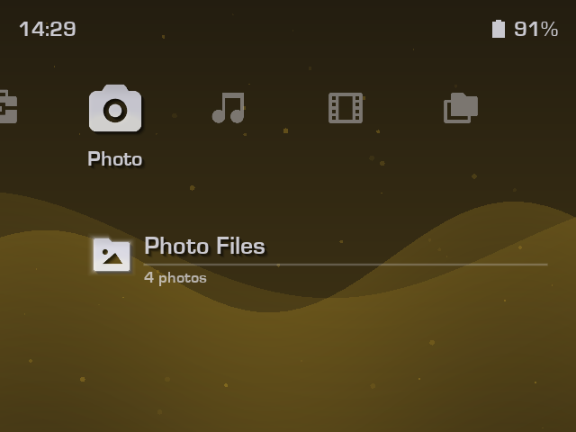

# XMPlayer

**XMPlayer** is an all-in-one, XMB-inspired media suite designed specifically for handheld gaming devices running **muOS** (support for other firmwares are planned). It provides a clean, easy-to-use interface for managing and enjoying your music, videos, and photos.

> XMPlayer is a **media suite application** for Linux handhelds running muOS (and other firmwares, WIP). It is **NOT** a custom firmware or an emulation frontend. The main focus is on media content **other than games**.

**Disclaimer:** XMPlayer is developed for educational purposes and is not affiliated with Sony or the XrossMediaBar brand.

---

## Features

- **XMB Interface:** A responsive XrossMediaBar UI we all know and love.
- **Responsive UI**: UI is responsive to different screen sizes, resolutions, and aspect ratios.
- **Content Indexing:** Content indexing allows handling large media libraries without slowing down the UI.
- **System Integration:** Live battery percentage and clock display in the status bar.
### Video Player
Integrated **MPV** support for high-performance video playback. 

 
A highly requested feature: resume playback from where you left off!

Watched state can be managed from the video context menu, which is opened with `X` from the video browser.

### Music Player
A dedicated audio player interface with album art, track info, and playback controls. Most audio formats, **including FLAC**, are supported. 

### Photo Viewer
Browse and view your photo collection.

### Customizable Themes
Fluid particle animations and customizable color themes to your liking. You can set a wallpaper too! 

> This project's aim is to utilize XMB's ease of use for media content and many people's familiarity in the retro gaming community. This project does not aim to fully replicate or provide 1:1 functionalities with the original XMB interface of Sony devices. This project is a reimagination and adaptation, not a hard copy.

---

## Installation

### Prerequisites
- A handheld device running **muOS**. At least 1 GB of RAM is recommended for a smooth experience.
- Your music, videos, and photos organized into dedicated folders on your SD card. Both single and dual SD card setups are supported.

### Steps
1. Download the latest release and put in in the `ARCHIVES` folder on your SD card.
2. Install the `XMPlayer.muxapp` file using Archive Manager.
3. Go to Applications menu and launch XMPlayer.
4. At launch, XMPlayer will ask you to set media directories. Use the file browser to select folders for each media type.
> **Need help where to locate?**  
> - For single SD card setups, the SD card contents are mounted to `/mnt/mmc`.  
> - For dual SD card setups, `/mnt/mmc` refers to the 1st SD card, and `/mnt/sdcard` refers to the 2nd.
5. XMPlayer will index your media library for you. After that, XMPlayer is ready to use.

---

## Controls

| Button | XMB Menu | Music Player | Video Player (MPV) | Photo Viewer |
| :--- | :--- | :--- | :--- | :--- |
| **D-Pad Left/Right** | Change Tabs | Previous/Next Track | Seek +-5s | Previous/Next Photo |
| **D-Pad Up/Down** | Navigate Menu Items | - | Seek +-60s | - |
| **A** | Select / Open / Confirm | Play / Pause | Play / Pause | Reset Zoom & Fit to Screen |
| **B** | Back / Cancel | Return to XMB | Skip Frames | Zoom Out |
| **X** | Context Menu | Playback Options | Toggle Mute | Zoom In |
| **Y** | - | (Y + D-Pad Right) Un/Lock Controls | Show OSD | (Hold Y + D-Pad) Pan |
| **L1** | - | - | Previous Video | - |
| **L2** | - | - | Toggle Subtitles | - |
| **R1** | - | - | Next Video | - |
| **R2** | - | - | Next Subtitle | - |
| **Start** | - | - | Play / Pause | - |
| **Select** | - | - | Return to XMB | Return to XMB |

---

## Customization

You can personalize XMPlayer via **Settings** > **Theme Settings**:

- **Theme:** Toggle between `Light` and `Dark` modes.
- **Theme Color:** Choose from the colors of RetroArch's color presets for its XMB interface.
- **Wallpaper:** Select an image from your photos as a wallpaper!
- **Wallpaper Effects:** Add blur, tint, brightness effects to better match your style.

>   
> i just wanna be part of your symphony 🐬

More customization options are on the way!

---

## Roadmap

### v0.1 (Current)
- [x] Mark/unmark videos as watched.
- [x] Play videos from where you left off.
- [x] Shuffle play: music (folder, album, artist)
- [x] Play all & Shuffle play: videos (folder)
- [x] Extended music playback controls. (repeat, hold, sleep, etc.)
- [x] Auto display sleep.
- [x] Continue playback while display turned off (+ lid closed for clamshells)
- [x] Wallpaper and customization.

### v0.2 (In Progress)
- [ ] Add support for other firmwares (Knulli, ROCKNIX, ArkOS, etc.)
- [ ] Custom playlists for video and music.
- [ ] More visualizer options.
- [ ] Photo gallery.
- [ ] Image slideshows.

### Planned for Later Versions
- [ ] External display support.
- [ ] Custom icon sets.
- [ ] VGM file support (through MPV)
- [ ] Add support for other media formats?

---

## License

XMPlayer is released under the **MIT License**.

---

## Credits

- Built with **Love2D**.
- Icons provided by **Remix Icon** library.
- System information provided by **muOS**.
- **PlayStation**, **XrossMediaBar**, and **XMB** are trademarks of Sony Interactive Entertainment Inc.

---

*Made with ❤️ for the retro gaming community.*
