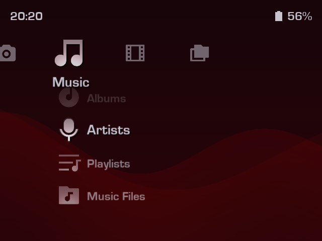
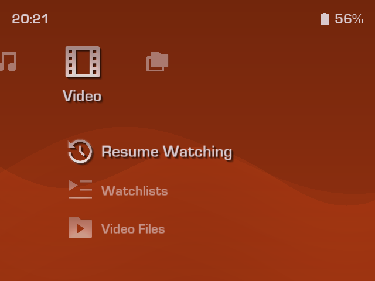
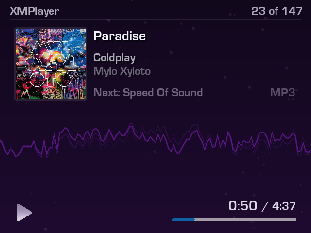
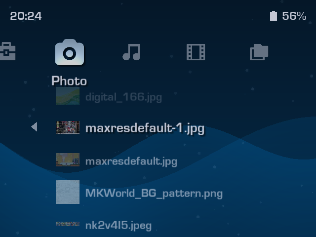
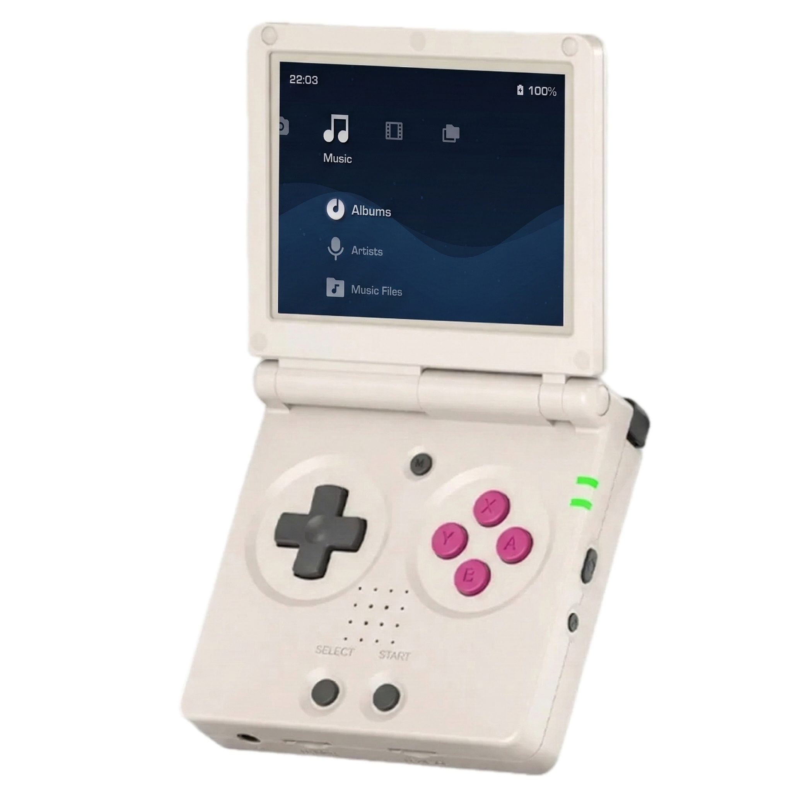
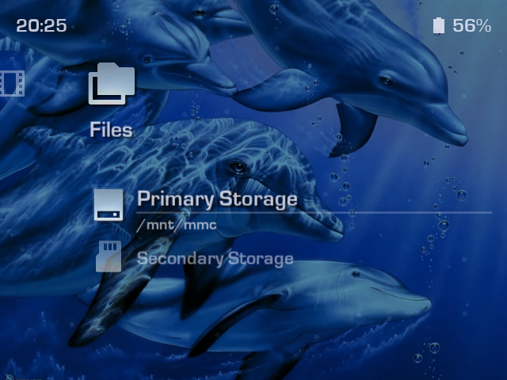

# XMPlayer

**XMPlayer** is an all-in-one, XMB-inspired media suite designed specifically for handheld gaming devices running **muOS** (and other CFWs with PortMaster support, test builds available). It provides a clean, easy-to-use interface for managing and enjoying your music, videos, and photos.

> XMPlayer is a **media suite application** for Linux handhelds. It is **NOT** a custom firmware or an emulation frontend. The main focus is on media content **other than games**.

**Disclaimer:** XMPlayer is developed for educational purposes and is not affiliated with Sony or the XrossMediaBar brand.

---

## Features

- **XMB Interface:** A responsive XrossMediaBar UI we all know and love.
- **Responsive UI**: UI is responsive to different screen sizes, resolutions, and aspect ratios.
- **Content Indexing:** Content indexing allows handling large media libraries without slowing down the UI.
- **System Integration:** Live battery percentage and clock display in the status bar.
### Video Player
Provides special configurations to CFW's built-in **MPV** and **ffplay** for high-performance video playback. 

 

### Music Player
A dedicated audio player interface with album art, track info, and playback controls. **Common audio formats** are supported. Moreover, basic support for **VGM files** and **chiptune formats** are available. Playback performance may differ depending on format and hardware, more information [here](docs/vgm_support_info.md). 

### Photo Viewer
Browse and view your photo collection.

### File Browser
Browse your handheld's file system and access media files outside the main directories. Both single and dual SD card setups are supported.

### Customizable Themes
Fluid particle animations and customizable color themes to your liking. You can set a (dynamic) wallpaper too! 

### No Games?
The goal of this project is to address the multimedia playback shortcomings of gaming handhelds. It is a Love2D application running under CFW. For the time being, I lack both the motivation and the skills to create a complete frontend. However, I do plan to add a feature in future releases that allows PSP game forwarding to PPSSPP for the sake of this app being for all-in-one media and nostalgia.

> This project's aim is to utilize XMB's ease of use for media content and many people's familiarity in the retro gaming community. This project does not aim to fully replicate or provide 1:1 functionalities with the original XMB interface of Sony devices. This project is a reimagination and adaptation, not a hard copy.

---

## Installation

### muOS App (.muxapp)

#### Prerequisites
- A handheld device running **muOS**. At least 1 GB of RAM is recommended for a smooth experience.
- Your music, videos, and photos organized into dedicated folders on your SD card. Both single and dual SD card setups are supported.

#### Steps
1. Download the latest release and put in in the `ARCHIVES` folder on your SD card.
2. Install the `XMPlayer.muxapp` file using Archive Manager.
3. Go to Applications menu and launch XMPlayer.
4. At launch, XMPlayer will ask you to set media directories. Set all media directories you plan to use from **Settings** > **Media Directories**.
> **Need help where to locate?**  
> - For single SD card setups, the SD card contents are mounted to `/mnt/mmc`.  
> - For dual SD card setups, `/mnt/mmc` refers to the 1st SD card, and `/mnt/sdcard` refers to the 2nd.
5. Under Media Directories, select **Reindex Media and Restart App**. XMPlayer will index your media library for you. After that, XMPlayer is ready to use.

### Experimental PortMaster Test Build

> **Important Notice** 
> Some features of XMPlayer may be currently unavailable or unstable depending on CFW. More information on compatibility available [here](docs/compatibility.md).

#### Prerequisites
- A handheld device running a CFW with PortMaster support. At least 1 GB of RAM is recommended for a smooth experience.
- **The latest version of PortMaster and runtimes** installed on your device.
- Your music, videos, and photos organized into dedicated folders on your SD card. Both single and dual SD card setups are supported.

#### Steps
1. Download the latest PortMaster **test release**.
2. Extract `XMPlayer.sh` and `xmplayer` into the dedicated ports folder(s) on your SD card.
3. Go to Ports section and launch XMPlayer.
4. At launch, XMPlayer will ask you to set media directories. Set all media directories you plan to use from **Settings** > **Media Directories**.
> **Need help where to locate?**  
> XMPlayer will try to guess the user directory based on which CFW you're using. If it fails, you may need to look it up from the CFW's documentation.
5. Under Media Directories, select **Reindex Media and Restart App**. XMPlayer will index your media library for you. After that, XMPlayer is ready to use.

---

## Controls

| Button | XMB Menu | Music Player | Video Player (MPV) | Video Player (ffplay) | Photo Viewer |
| :--- | :--- | :--- | :--- | :--- | :--- |
| **D-Pad Left/Right** | Change Tabs | Previous/Next Track | Seek -+5s | Seek -+5s | Pan Left/Right |
| **D-Pad Up/Down** | Navigate Menu Items | - | Seek -+60s |Seek -+60s | Pan Up/Down |
| **A** | Select / Open / Confirm | Play / Pause | Play / Pause | Play/Pause | Reset View |
| **B** | Back / Cancel | Return to XMB | Skip Frames | Skip Frames |Zoom Out |
| **X** | Context Menu | Playback Options | Toggle Mute | Toggle Mute | Zoom In |
| **Y** | - | (Hold) Hotkey Display | Show OSD **Menu+Y:** Toggle OSD | - | Rotate 90° |
| **L1** | - | Previous Track | Previous Video | - | Previous Image |
| **L2** | - | Seek -10s | Cycle Audio Tracks | - | - |
| **R1** | - | Next Track | Next Video | - | Next Image |
| **R2** | - | Seek +10s | Cycle Subtitles | - | - |
| **Start** | - | - | Adjust Aspect Ratio **Menu+Start:** Adjust Video Zoom (Panscan) | - | Toggle Info |
| **Select** | - | - | Return to XMB | Return to XMB | Return to XMB |
---

## Customization

You can personalize XMPlayer via **Settings** > **Theme Settings**:

- **Theme:** Toggle between `Light` and `Dark` modes.
- **Theme Color:** Choose from the colors of RetroArch's color presets for its XMB interface.
- **Wallpaper:** Select an image from your photos as a wallpaper!
- **Wallpaper Effects:** Add blur, tint, brightness effects to better match your style.

>   
> i just wanna be part of your symphony 🐬

More customization options are on the way!

---

## Roadmap

### v0.1 (Legacy)
- [x] Mark/unmark videos as watched.
- [x] Play videos from where you left off.
- [x] Shuffle play: music (folder, album, artist)
- [x] Play all & Shuffle play: videos (folder)
- [x] Extended music playback controls. (repeat, hold, sleep, etc.)
- [x] Auto display sleep.
- [x] Continue playback while display turned off (+ lid closed for clamshells)
- [x] Wallpaper and customization.

### v0.2 (Current)
- [x] Portmaster build target and test releases.
- [x] Custom playlists for video and music.
- [x] More visualizer options.
- [x] VGM file support (.spc, .nsf, ...)

### Planned for Later Versions
- [ ] Photo gallery.
- [ ] Image slideshows.
- [ ] External display support.
- [ ] Custom icon sets.
- [ ] Add support for other media formats?

## Credits

- Built with **Love2D**.
- Icons provided by **Remix Icon** library.
- simpleScale script from [tomlum's simpleScale](https://github.com/tomlum/simpleScale).
- System information provided by **muOS** & **Knulli**.
- **PlayStation**, **XrossMediaBar**, and **XMB** are trademarks of Sony Interactive Entertainment Inc.

---
